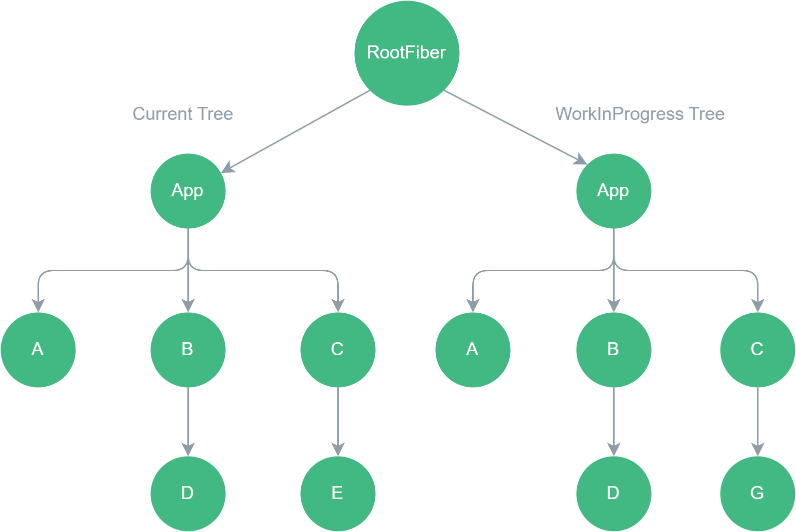
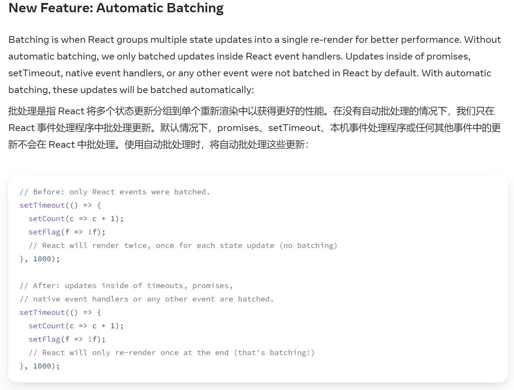

# React

## React合成事件和原生事件的区别？

- 名称不同：原生事件名称都是小写，合成事件的名称是驼峰式的。
- 使用方式不同：原生直接使用字符串绑定，合成事件使用大括号绑定。
- 阻止浏览器默认行为： 原生的事件函数返回false ，合成事件使用preventDefault()。
- 事件对象不同，React合成事件的事件对象可以通过nativeEvent属性访问原生事件对象。
- React合成事件没有像原生事件一样直接绑定到对应的DOM上，而是利用事件委托和事件冒泡统一注册在顶层（document/root element）。

那为什么React要使用合成事件？

1. 抹平兼容性差异。
2. 实现跨平台。
3. 可以自定义事件。
4. 优化，利用事件委托都将事件代理到document/root element，减少内存开销。
5. 干预事件的分发，依托fiber架构可以干预事件的分发来提升用户体验。

## 为什么使用Hooks?/Hook的作用时什么？

1. 复杂组件的逻辑便于抽离。
2. 复用逻辑。
3. class组件的this不易理解，给使用者造成额外的心智负担。

## useEffect 和 useLayoutEffect 的区别 以及使用场景

```js

useEffect(() => console.log('组件更新时执行')) // 类似于componentDidUpdate

useEffect(() => {
    console.log('组件挂载时执行'); // 类似于componentWillMount
    return () => {
        console.log('组件卸载时执行') // 类似于componentWillUnmount
    }
},[])

useEffect(() => {
      console.log('组件挂载时或者依赖变更时执行'); // 类似于componentWillMount加上componentDidUpdate
    return () => {
        console.log('组件卸载时或者依赖变更时执行') // 依赖变化时会先使用旧的state和props执行该函数，然后再执行setup回调函数
    }
},[deps])

```

`useLayoutEffect`的用法和`useEffect`一样，但是它们的setup回调执行的时机不同：

VDOM更新 -> DOM更新 -> `useEffect`
VDOM更新 -> `useLayoutEffect` -> DOM更新

**useEffect**的使用场景：

1. 副作用与DOM无关，例如数据获取、订阅操作等。
2. 不需要立即同步读取或更改DOM。使用`useEffect`读取和更改DOM可能会出现闪烁。
3. 性能优先。使用`useEffect`性能影响较小，不会阻塞浏览器的渲染，而`useLayoutEffect`则会。

**useLayoutEffect**的使用场景：

1. 需要立即同步读取或更改DOM。例如在渲染之前需要获取元素的大小或位置等属性并做修改。
2. 防止闪烁。
3. 模拟生命周期方法。使用`useLayoutEffect`可以模拟 `componentDidMount`、`componentDidUpdate`和`componentWillUnmount`的同步行为。


## Fiber架构的原理和工作模式？

React执行流程：JSX -> `React.createElement()` -> Fiber Node -> DOM render 

**什么是fiber?**

我们编写的JSX代码会被React在底层使用`createElement`转换为JS对象，这个对象就是虚拟DOM，16.8后React实现了一套新的调度算法，使用到的结构就是fiber树（类似于虚拟DOM树，但同时也就有链表的结构），fiber树也是用来描述DOM结构的，它的每个节点就是fiber node，代表了一个工作单元，包含了组件相关的信息，同时它还是React调度和更新机制的核心组成。

Fiber结构如下源码所示，fiber也可以理解为更加强大的虚拟DOM ：

```js
function FiberNode(
  this: $FlowFixMe,
  tag: WorkTag,
  pendingProps: mixed,
  key: null | string,
  mode: TypeOfMode,
) {
  // 基本属性
  this.tag = tag; // 描述当前Fiber的启动模式的值（LegacyRoot = 0; ConcurrentRoot = 1）
  this.key = key; // React key Fiber的唯一标识
  this.elementType = null; // React元素的类型
  this.type = null; // 组件类型
  this.stateNode = null; // 如果是类组件，它指的是类的实例；如果是DOM元素，它就是对应的DOM节点。

  // Fiber 之间的关系
  this.return = null; // 指向父fiber
  this.child = null; // 指向第一个子fiber
  this.sibling = null; // 指向兄弟fiber
  this.index = 0; // 子fiber中的索引位置

  this.ref = null; // 如果组件上有ref属性，则该属性指向它
  this.refCleanup = null; // 如果组件上的ref属性在更新中被删除或更改，此字段会用于追踪需要清理的旧ref

  // Props & State
  this.pendingProps = pendingProps; // 正在等待处理的新props
  this.memoizedProps = null; // 上一次渲染时的props
  this.updateQueue = null; // 一个队列，包含了该Fiber上的状态更新和副作用
  this.memoizedState = null; // 上一次渲染时的state
  this.dependencies = null; // 该Fiber订阅的上下文或其他资源的描述
  
  //工作模式
  this.mode = mode; //// 描述Fiber工作模式的标志，例如Concurrent mode、Blocking mode。

  // Effects
  this.flags = NoFlags; // 描述该Fiber发生的副作用的标志（十六进制的标识）
  this.subtreeFlags = NoFlags; // 描述该Fiber子树中发生的副作用的标志（十六进制的标识）
  this.deletions = null; // 在commit阶段要删除的子Fiber数组

  this.lanes = NoLanes; // 与React的concurrent mode 有关的调度概念。
  this.childLanes = NoLanes;// 与React的concurrent mode 有关的调度概念。

  this.alternate = null; // Current Tree和WorkInProgress Tree的互相指向对方tree里的对应单元
}
```

**为什么需要Fiber?**

16.8版本之前的React使用递归的方式处理组件树更新（堆栈调和Stack Reconciliation）,这种方式一旦开始就无法中断，直到整个组件树被遍历完。在处理复杂结构和海量数据的情况下可能会导致主线程被阻塞，使得应用无法及时响应用户的交互或者其他高优先级的任务。而fiber树则同时具有链表结构，React在处理每一个fiber节点时都会判断是否有足够的时间完成这个节点的工作，并在必要时中断和恢复。

 **Fiber工作原理**

借由fiber node的结构可以看出，整个fiber树实际上是一个链表树，既有链接属性，又有树的结构。得益于这样的特性，使得React在遍历整棵fiber树时可以知道从哪里开始，哪里停止，又在哪里继续，这就是fiber树可以中断和恢复的前提条件。其中的`memoizedProps`、`pendingProps` 和 `memoizedState` 字段让React知道组件的上一个状态和即将应用的状态。通过比较这些值，React可以决定组件是否需要更新，从而避免不必要的渲染，提高性能。`flags` 和 `subtreeFlags` 字段标识Fiber及其子树中需要执行的副作用，例如DOM更新、生命周期方法调用等。React会积累这些副作用，然后在Commit阶段一次性执行，从而提高效率。

除此之外，React还实现了**双缓冲机制**。简单来讲，React在更新时会根据现有的fiber树（current tree）创建一个新的fiber树(workInProgress)，这个新的fiber树保存在内存中，在后台更新，current tree就是当前渲染在界面上的视图，它是RootFiber这个节点的子树。 当workInProgress tree完成更新后，RootFiber就指向了workInProgress tree, 此时workInProgress tree就成为了current tree， 它被渲染到界面上，而旧的current tree则变成了workInProgress tree。正是由于React同时维护着两棵fiber树，所以可以随时进行比较、中断和恢复，也使得React拥有优秀的渲染性能。





**Fiber的工作流程**

两个阶段，调和(Reconciliation)阶段和提交(Commit)阶段。

调和阶段 —— 确定哪些部分的UI需要更新，通过在构建WorkInProgress Tree的过程中比较新旧Props和旧fiber树来确定。这个阶段同样需要遍历fiber树，它为什么比老版本的递归遍历要高效和快速呢？得益于fiber node中`flags` 或 `subtreeFlags`字段，它们是16进制的标识，通过按**位或运算**后可以记录当前fiber节点和子树的副作用类型，在当前fiber节点和子树的副作用都为null时则不用继续递归，直接复用节点和子树。

提交阶段 —— 更新DOM并执行任何副作用，通过遍历调和阶段创建的副作用列表实现。当进入提交阶段后，React无法进行中断。

## setState的原理和机制？它为什么是异步的？

React18中setState默认是**异步/批量**的，18版本以前在原生DOM事件回调中和setTimeout/promise回调中setState是同步执行的，即可以在执行setState后立即拿到最新值，而在React合成事件和生命周期中是异步执行的。

异步：setState后面代码无法在setState后立即拿到最新的state，它表现得像异步执行，**实际上不是传统意义上的异步执行（setTimeout/Promise）**。

批量：连续多次调用setState会合并成一个更新操作，UI只会重新渲染一次。



原理：

- fiber架构之前： 执行`setState` -> 合并状态数据到组件的状态队列中，不立即执行 -> 根据新的状态数据生成一个新的虚拟DOM树，表示预期的输出结果 -> 比较新旧虚拟DOM树确定需要进行的实际DOM更新 -> 计算两棵树的差异，这些差异代表对实际DOM进行的最小更改 -> 批处理更新实际的DOM

- fiber架构之后：执行`setState` -> 将更新请求放入队列中，不立即执行，继续后续的任务 -> 进入调度阶段，生成新的fiber树（workInprogress树），用于描述预期的输出 -> 比较workInprogress fiber树和当前渲染使用的fiber树，确定需要的实际DOM更新 -> 计算两个fiber树的差异，这些差异代表对实际DOM进行的最小更改 -> 将计算出的差异转换为更新队列，队列包含需要更新的组件和DOM节点 -> 优先级调度，确保重要的任务优先执行 -> 按照优先级顺序执行更新队列中的任务来批量处理更新实际DOM。

设计成异步的理由：

1. 提升性能，避免每次调用`setState`都重新渲染组件。（性能损耗一般在虚拟DOM树diff过程）
2. 避免`state`和`props`无法同步。如果`setState`是同步执行的，那么就会立即更新组件内部的`state`，但是render函数中传递的`props`还是旧值，这就导致了`state`和`props`的不一致。

## setState批量更新是如何实现的？

React 中的 `setState` 批量更新是通过 `enqueueSetState` 函数实现的。当在组件中多次调用`setState`时，React并不会立即更新组件的状态，而是将状态更新请求添加到一个队列中，然后在合适的时机批量处理这些更新请求。

```ts
function batchedUpdates<A, R>(fn: (a: A) => R, a: A): R {
  // 当前是否 批量更新赋值到 previous 状态上
  const previousIsBatchingUpdates = isBatchingUpdates;
  isBatchingUpdates = true;
  try {
    return fn(a); // 这里调用的是事件处理函数
  } finally {
    // 将过去上一次更新的 previous 存到全局变量 BatchingUpdates 上
    isBatchingUpdates = previousIsBatchingUpdates;
    // 当不是批量更新 而且不是在渲染阶段，那么state的值将会一次更新，调用 performSyncWork
    if (!isBatchingUpdates && !isRendering) {
      performSyncWork(); // 直接同步一起更新
    }
  }
}

```

这种批量更新的机制可以确保在一个更新周期内，只进行一次更新操作，从而避免不必要的重复渲染。这对于性能优化至关重要，特别是在处理大量状态更新时。

## useRef的原理和机制？为什么它不会导致UI重新渲染？/为什么它的值在组件的生命周期中是不变的？

`useRef`函数接受一个初始值initialValue，并返回一个可变的ref对象，这个对象上面存在一个属性current，默认值就是initialValue。和`useState`不同的是，`useState`返回的是不可变的值，每一次render都是新值，而ref对象在组件的生命周期中不会改变，其current属性可以被赋任意值，也就是说无论何时访问ref对象都能获取到最新值。

当初始化`useRef`时实际是调用内部的`mountRef`方法，流程如下：

```ts
function mountRef<T>(initialValue: T): {|current: T|} {
  const hook = mountWorkInProgressHook();
  const ref = {current: initialValue};
  hook.memoizedState = ref;
  return ref;
}
```

1. 调用**mountWorkInProgressHook**创建一个React内部的hook对象，并按照顺序加入到构建的hook链表中。
2. 创建一个ref对象，将初始化值赋值给该对象的current属性。
3. 将ref对象存储在hook对象的`memoizedState`属性上。
4. 最后返回ref对象。

当修改ref对象的current值时，流程如下：

```ts
function updateRef<T>(initialValue: T): {|current: T|} {
  const hook = updateWorkInProgressHook();
  return hook.memoizedState;
}
```

1. 通过`updateWorkInProgressHook`方法拿到函数组件加载时对应的hook对象。
2. 返回hook对象的`memoizedState`属性值。

通过上面原理可以知道，组件更新时引用的对象永远是同一个ref对象， 而不会重新创建新的ref对象。这是因为hook对象都是存储在组件的fiber对象上，这确保了ref对象不可变，这样在组件的生命周期内ref对象的current值永远都是被赋值的最新值，除了手动修改current值之外它是不会改变的。

## React事件处理机制是怎么样的？16和17版本又有什么不同？

React自己实现了一套事件系统，它的事件是合成事件，主要的目的是抹平不同浏览器之间的兼容性差异。

机制总结： **顶层注册，存储回调，事件派发**。

**顶层注册**：React合成事件机制采用了事件委托的思想。在React组件挂载时会根据组件内声明的事件类型（onClick,onChange等）在document上注册相应依赖的原生事件（使用addEventListener注册，17版本后则是在root element上注册），并且捕获阶段和冒泡阶段的事件都会注册。在注册事件时会指定统一的回调函数dispatchEvent,也就是说同一种类型的事件它的回调函数是一样的，这样就减少了内存开销。

**存储回调**： React为了在触发事件时可以查找到实际对应的回调函数去执行，会把组件内的所有事件统一地存放到一个对象中（listenerBank）。而存储方式如下所示，首先会根据事件类型分类存储，例如 click 事件相关的统一存储在一个对象中，回调函数的存储采用键值对（key/value）的方式存储在对象中，key 是组件的唯一标识 id，value 对应的就是事件的回调函数。

```js
// listenerBank
{
  click: {
    key1: fn,
    key2: fn,
    ...
  }
  change:{
    key1:fn,
    key2:fn,
    ...
  }
}
```
**事件派发**： React的事件触发只会发生在DOM事件流的冒泡阶段，因为注册时默认在冒泡阶段执行。流程如下：

1. 触发事件，开始DOM事件流，事件捕获 -> 处于目标阶段 -> 事件冒泡。
2. 当事件冒泡到document（17版本是root element）时，触发统一的分发函数。
3. 根据原生事件对象nativeEvent找到当前节点（事件触发节点）对应的React Component对象。
4. 事件合成： 根据当前事件类型生成对应的合成对象 -> 封装原生事件对象和冒泡机制 -> 查找当前元素以及它所有父级 -> 在listenerBank中查找事件回调函数并合成到 events 中。
5. 批量执行合成事件（events）内的回调函数。
6. 如果没有使用**stopImmediatePropagation**方法阻止冒泡，会将继续进行 DOM 事件流的冒泡（从 document 到 window），否则结束事件触发。

::: tip
注意： 阻止冒泡如果使用stopPropagation方法时，当document/root element上还有同类型的其他事件时也会被触发执行，但是window上不会被执行。
:::

由此可知，由于React的事件委托机制，React组件对应的DOM节点上的原生事件触发时机总是在React组件内注册的合成事件之前。


## React为什么在处理列表时推荐使用唯一的key属性？这与DIFF算法有什么关系？

React中需要在列表元素或动态生成元素上使用key属性用作元素的唯一标识，让每一个元素具有唯一性，在DIFF过程中通过比较新旧元素，如果有key相同的新旧节点时，则会执行移动操作，而不会执行先删除旧节点再创建新节点的操作，并且通过唯一key值可以在DIFF过程中快速定位对应元素，从而减少DIFF算法的时间复杂度，这些都大大提高了React的性能和效率。

## 为什么建议传递给setState的参数是一个callback而不是一个对象/值？

主要原因是`setState`是异步执行且批量更新的，建议传入callback而不是对象的理由如下：

1. 确保获取最新值。通过传递一个回调函数作为参数，可以确保在当前更新状态时获取到上次更新后的最新状态值。回调函数的参数是前一个状态值，可以基于该值进行计算和更新。这样可以避免依赖于旧状态值但无法获取最新值的问题。

```js

const [users,setUsers] = useState([])

setState(prev => [...prev,'user1']) // prev is []

setState(prev => [...prev,'user2']) // prev is ['user1']

```

2. 避免状态更新问题。在对相同状态进行多次更新时，`setState`会在内部将这些更新合并为一个，这就是批处理。如果多次调用`setState`时传入对象，后续的调用可能会出现覆盖前面的调用，从而导致状态更新不符合预期。

```js
const [count,setCount] = useState(0)

// 在某个场景中我需要连续增加count

function operation() {
  setCount(count + 1) // 1
  setCount(count + 1)  // 1
}

function operation2() {
  setCount(prev => prev + 1) // 1
  setCount(prev => prev + 1) // 2
}
```
对于以上代码，`operation`中两次调用的`setState`是直接传入值进行更新，react对于这种多次对相同状态更新的操作进行了合并，导致实际上`count`只增加了一次，而`operation2`中使用callback的方式进行更新，react会将这个callback放入更新队列中依次执行更新，最后得出计算结果，因此`count`实际上被增加了两次。

## 简述下flux思想？

Flux 是一种应用程序架构思想，旨在帮助管理复杂的前端应用程序中的数据流。它最初由 Facebook 提出，用于解决 React 应用中数据流管理的问题。以下是 Flux 思想的简要概述：

- 单向数据流：Flux 架构中的核心概念是单向数据流。数据在应用中的流动是单向的，沿着固定的路径流动，这样可以更容易追踪数据的变化和管理数据流。

- 组件化：Flux 鼓励将应用程序拆分为多个独立的组件，每个组件负责特定的功能。这种组件化的设计使得代码更易于维护和扩展。

- Action：在 Flux 中，用户操作或事件会触发一个 Action，表示发生了某种行为。Action 是一个简单的对象，描述了事件的类型和相关数据。

- Dispatcher：Dispatcher 是 Flux 架构中的中心枢纽，负责接收所有的 Action，并将它们分发给注册的 Store。

- Store：Store 是应用中存储数据的地方，它负责管理应用的状态和数据。当 Store 接收到 Action 后，会根据 Action 的类型更新自己的状态，并触发视图更新。

- View：View 层负责渲染用户界面，并根据 Store 的状态更新界面。View 从 Store 中获取数据，并监听 Store 的变化以及时更新界面。

- 流程：用户操作会触发 Action，Dispatcher 将 Action 分发给 Store，Store 更新状态后通知 View 更新界面，这样形成了一个单向数据流的循环。


通过这种单向数据流的架构，Flux 提供了一种清晰的数据管理方式，使得应用程序中的数据流动更加可控和可预测。尽管 Flux 本身并不是一个具体的库或框架，但它提供了一种思想和架构模式，可以帮助开发者更好地组织和管理复杂的前端应用程序。


