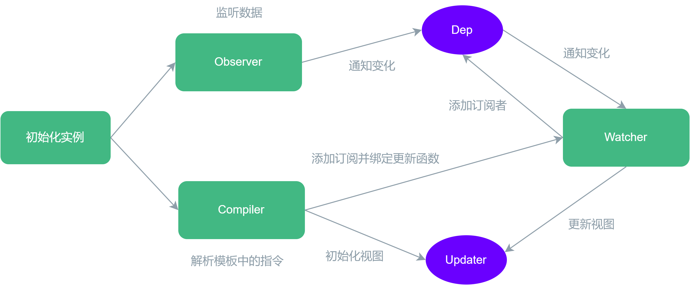
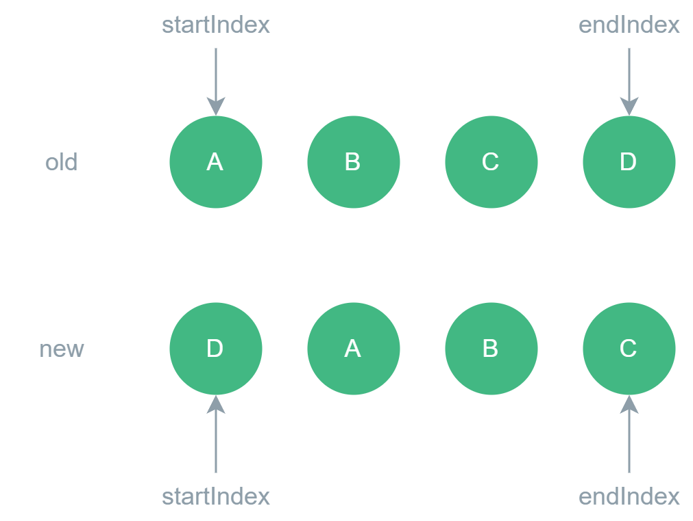

# Vue

## 说说 Vue 的响应式原理，它和 React 有什么区别？

Vue2.x 是依赖 `Object.defineProperty()`实现响应式，缺点是无法监听对象属性的删除和添加，对于数组也无法监听到变化，同时对深层对象的递归监听有较大的性能损耗。

Vue3 则是借助 ES6 新增的 [Proxy API](https://developer.mozilla.org/zh-CN/docs/Web/JavaScript/Reference/Global_Objects/Proxy) 对对象进行代理从而实现响应式，`Proxy`可以拦截和自定义对象的基础操作，当然也可以监听到数组的变化（`push`,`shift`,`splice`）。`Proxy`也不能监听到内部深层对象的变化，但 Vue3 的处理方式是在`getter`中去递归代理，这样只有真正被访问到的内部深层对象才会变为响应式，避免了盲目地对所有内部对象进行递归，提升了性能。

下面是一个简单`Proxy`拦截嵌套对象的例子：

```js
const target = {
  nested: {
    deep: {
      value: 42,
    },
  },
};

const handler = {
  get: function (target, property, receiver) {
    console.log(`访问属性: ${property}`);
    const value = Reflect.get(target, property, receiver);
    if (typeof value === "object" && value !== null) {
      return new Proxy(value, handler); // 返回一个新的 Proxy 对象
    }
    return value;
  },
  set: function (target, property, value, receiver) {
    console.log(`设置属性: ${property} = ${value}`);
    return Reflect.set(target, property, value, receiver);
  },
};

const proxy = new Proxy(target, handler);

console.log(proxy.nested.deep.value);
// 访问属性: nested
// 访问属性: deep
// 访问属性: value
// 42
```

React 的响应式是依赖于虚拟 DOM 的 DIFF 算法以及自顶向下的单向数据流，当组件的内部的 `state` 发生变化，通过对比前后虚拟 DOM 从而触发 `render` 函数进行 UI 的变更。

## 说说 Vue 的生命周期

Vue 的生命周期主要分为 8 个阶段：创建前后，更新前后，销毁前后，以及一些其他特殊场景的生命周期。

|           生命周期            |             描述             |                                               使用场景                                                |
| :---------------------------: | :--------------------------: | :---------------------------------------------------------------------------------------------------: |
|      beforeCreate/setup       |      组件实例被创建之前      |                       执行时组件实例还未创建，通常用于插件开发中一些初始化任务                        |
|         created/setup         |       组件实例创建完成       | 组件初始化完毕，当 DOM 还未生成，此时响应式数据、计算属性、方法和侦听器都可以使用，常用于异步数据获取 |
|   beforeMount/onBeforeMount   |   组件实例挂载到 DOM 之前    |                                    DOM 还未生成，此时无法操作 DOM                                     |
|       mounted/onMounted       |   组件实例挂载到 DOM 完成    |                        初始化结束，DOM 创建完毕，此时可以操作 DOM 或则访问数据                        |
|  beforeUpdate/onBeforeUpdate  |  组件数据发生变化，更新之前  |                    数据变化前，此时可以访问旧数据，但 DOM 还未更新，可以做一些优化                    |
|       updated/onUpdated       |       组件数据更新完成       |                          更新后，此时所有数据都是最新的，可以对新数据做处理                           |
| beforeDestroy/onBeforeUnmount |       组件实例销毁之前       |                               通常用于清理定时器、解绑事件或取消订阅等                                |
|     destroyed/onUnmounted     |       组件实例销毁完成       |                          组件实例已经被销毁，此时组件实例不再可用，作用同上                           |
|           activated           | keep-alive 缓存的组件被激活  |                                                                                                       |
|          deactivated          | keep-alive 缓存的组件被失活  |                                                                                                       |
|         errorCaptured         | 捕获到组件渲染过程报错时调用 |                               用于处理异常，例如错误上报，收集异常等等                                |

**生命周期流程示意图**如下：


通常情况下，数据请求可以在`created/setup`或`mounted/onMounted`中进行，区别在于它们的触发时机不同，前者是在组件实例创建完成后立即调用，此时 DOM 还未生成；后者是 DOM 挂载完成后立即执行，可以访问到 DOM。两个阶段都可以获取到组件实例对象的属性和方法，如果在`mounted/onMounted`中获取数据可能会导致页面闪烁(DOM 已经渲染完成，数据获取到后更新 DOM)，因此对于组件中初始化时需要进行的异步数据获取或不需要依赖 DOM 的操作建议放在`created/setup`中。

## Vue3 相比 Vue2 有哪些变化？

1. 根节点不同： Vue2 必须要有根标签，而 Vue3 则可以没有根标签，会默认将多个根标签包裹在一个`Fragement`中，这样处理减少了内存的消耗。

2. API 风格不同: Vue2 中采用的是 Options API,将函数和数据集中处理，各个功能的代码混合在一块，而 Vue3 采用 Composition API，可以将同一功能的代码集中在一块，同时可以更好地组织与复用逻辑。

3. 生命周期不同：

- 创建前：`beforeCreate` -> 使用`setup()`

- 创建后：`created` -> 使用`setup()`

- 挂载前：`beforeMount` -> `onBeforeMount`

- 挂载后：`mounted` -> `onMounted`

- 更新前：`beforeUpdate` -> `onBeforeUpdate`

- 更新后：`updated` -> `onUpdated`

- 销毁前：`beforeDestroy` -> `onBeforeUnmount`

- 销毁后：`destroyed` -> `onUnmounted`

- 异常捕获：`errorCaptured` -> `onErrorCaptured`

- 被激活：`onActivated` 被包含在`<keep-alive>`中的组件，会多出两个生命周期钩子函数。被激活时执行。

- 切换：`onDeactivated` 比如从 A 组件，切换到 B 组件，A 组件消失时执行

4. `v-if` 和 `v-for` 的优先级: Vue2 中 `v-for` 优先级高于 `v-if`,两者可以一起使用，但是会带来性能上地浪费；Vue3 中 `v-if` 优先级高于 `v-for`，一起使用会报错。

5. 响应式原理不同： Vue2 通过`Object.definedProperty()`的`get()`和`set()`来做数据劫持、结合和发布订阅者模式来实现，`Object.definedProperty()`会遍历每一个属性。而 Vue3 通过`Proxy`代理的方式实现，不需要像`Object.definedProperty()`的那样遍历每一个属性，有一定的性能提升。`Proxy`可以理解为在目标对象之前架设一层“拦截”，外界对该对象的访问都必须通过这一层拦截。这个拦截可以对外界的访问进行过滤和改写。

6. diff 算法不同： Vue2 中的 DIFF 算法会遍历每一个虚拟 DOM 并进行新旧 DOM 对比，并返回一个`patch`对象来记录两个节点的不同，然后用`patch`信息去更新 DOM（边记录边更新）。这样的处理方式会比较每一个节点，对于没有发生更新的节点的比较是多余的，这就照成了不必要的性能浪费。Vue3 中改进了 diff 算法，在初始化时会给每一个节点添加`patchFlags`标识，在 diff 过程中只会比较`patchFlags`发生变化的节点，而`patchFlags`没有变化的节点做**静态标记**，渲染时直接复用节点。

7. Vue3弃用了`filters`,内联模板，实例方法`$on`、`$off` 和 `$once`。

具体变化请查阅文档: [Vue3 非兼容性改变](https://v3-migration.vuejs.org/zh/breaking-changes/)。

## Vue3 做了哪些优化？

1. 更好的 TypeScript 支持： Vue3 全面采用 TypeScript 重写，提供了更好的类型推断和类型提示，也提供了更多的内置类型声明，使得开发时更容易发现代码错误和调试。

2. 更快的渲染性能： Vue3 重写了虚拟 DOM 的实现，带来了 diff 算法的优化（静态标记）,编译模板的优化（静态提升）以及更高效的组件初始化。

**静态标记**： 对于不会发生变化的节点标记为静态，这样在下一次更新时可以跳过 diff 算法的比较以快速定位到需要更新的节点，从而提高性能。

**静态提升**： 对于不参与更新的静态部分，Vue3 会将其创建函数提升到所在模板渲染函数的外部，这样每次渲染时直接复用它们，避免了重复创建，在 diff 过程中也是会完全跳过。当有大量连续的静态节点时，它们会被进一步压缩为一个静态`vnode`，其中包含的是这些节点对应的 HTML 字符串,这些静态节点会直接使用`innerHTML`来挂载。而在初始挂载后，这个静态`vnode`会被缓存，当其他地方使用到它时会 Vue 使用原生`cloneNode()`方法克隆，这是非常高效的做法。

**事件监听缓存**： 对事件监听器进行缓存，避免每次更新都要追踪其变化。

3. 更小的体积： Vue3 移除了 Vue2 中不常用的 API，核心运行时比 Vue2 更小，并且支持 Tree-shaking，这意味着 Vue3 项目拥有更小的打包体积。

4. 更灵活的组合式 API： 组合式 API 提供了更直观、更灵活的方式来组织组件代码，使得代码更易读、易维护。

5. 更好的响应式系统：Vue3 使用了`Proxy`来重写响应式系统，相比 Vue2 使用的`Object.defineProperty()`，更加直观和强大，并且可以在更深的层次上追踪响应式变量的变化，使得开发者能够更准确地监听数据变化。

## Vue 组件通信的方式有哪些？

1. 通过 `props` 传递数据，适用于父传子场景。

2. 通过 `$emit` 触发自定义事件，适用于子传父场景。

3. 使用 `ref` 获取子组件的实例，从而在父组件中获取子组件的数据。

4. EventBus： 适用于兄弟组件之间传值。具体为创建一个中央事件总线，兄弟组件通过`$emit`触发自定义事件，其他兄弟组件通过`$on`监听自定义事件。**Vue3 中不推荐使用该方式**。

```js
class EventBus {
  constructor() {
    this.callbacks = {};
  }
  $on(name, fn) {
    this.callbacks[name] = this.callbacks[name] || [];
    this.callbacks[name].push(fn);
  }
  $emit(name, args) {
    if (this.callbacks[name]) {
      this.callbacks[name].forEach((cb) => cb(args));
    }
  }
}

// main.js
Vue.prototype.$eventBus = new EventBus(); // 将$eventBus挂载到vue实例的原型上
// 另一种方式
Vue.prototype.$eventBus = new Vue(); // Vue已经实现了Bus的功能
```

5. 通过共同祖辈`$parent`或者`$root`搭建通信桥连,Vue3 中使用`getCurrentInstance()`获取当前组件实例，然后通过其`parent`或者`root`属性获取对应的父组件或祖先组件实例。**Vue3 中不推荐使用该方式**。

```js
// 兄弟组件
this.$parent.on("add", this.add);

//另一个兄弟组件

this.$parent.emit("add");
```

6. 透传 Attributes: 适用于祖先组件传递给子孙组件。“透传 attribute”指的是传递给一个组件，却没有被该组件声明为`props`或`emits`的 attribute 或者`v-on`事件监听器。最常见的例子就是 class、style 和 id。Vue3 中可以使用`useAttrs()`访问所有的透传 attributes。

7. `Provide` 与 `Inject` （依赖注入）：祖先/顶层组件通过定义`provide(key,value)`来为子孙组件提供数据，子孙组件通过`inject(key,defaultValue)`来获取。

```vue
<script setup>
// 祖先组件提供数据
import { ref, provide } from "vue";
const count = ref(0);
provide(/* 注入名 */ "count", /* 值 */ count);
</script>
```

```vue
<script setup>
// 子孙组件中消费
import { inject } from "vue";
const count = inject("count");
</script>
```

8. Vuex/Pinia: 适用于需要跨多个复杂关系组件传递数据或页面共享状态等场景。

```js
// stores/counter.js
import { defineStore } from "pinia";

export const useCounterStore = defineStore("counter", {
  state: () => {
    return { count: 0 };
  },
  // 也可以这样定义
  // state: () => ({ count: 0 })
  actions: {
    increment() {
      this.count++;
    },
  },
});
```

```vue
<script setup>
// 组件中使用
import { useCounterStore } from "@/stores/counter";

const counter = useCounterStore();

counter.count++;
counter.$patch({ count: counter.count + 1 });
// 或使用 action 代替
//counter.increment()
</script>
<template>
  <!-- 直接从 store 中访问 state -->
  <div>Current Count: {{ counter.count }}</div>
</template>
```

## Vue 中数据的双向绑定是如何实现的？原理是什么？

简单的说，Vue 的数据双向绑定是通过**数据劫持**配合**发布-订阅模式**实现的。

::: info 数据劫持
数据劫持是指在访问或修改对象属性时，通过拦截的方式进行额外的处理。
:::

1. 数据劫持：当创建 Vue 实例时，Vue 会遍历传入的数据对象并进行响应化处理，通过设置一个`Observer`来监听所有属性。Vue2 通过 `Object.defineProperty()`设置对象 `setter` 和 `gettter` 方法来拦截对数据的读取和修改操作，而 Vue3 中则通过 `Proxy` 实现拦截和自定义对象的基本操作的。

2. 编译模板： 初始化时，同时使用指令解析器`Compile`对每个节点元素扫描解析，找到动态绑定的指令并替换成数据。同时初始化一个订阅者`Watcher`并添加指令绑定的相应更新函数，将来数据变化时`Watcher`可以执行更新函数从而更新视图。

3. 依赖收集： 由于订阅者会出现多个，所以需要一个消息订阅器`Dep`来专门收集这些订阅者，统一管理。

4. 更新：如果某个数据发生更新，会先找到消息订阅器`Dep`，通知所有的订阅者`Watcher`执行更新函数。



总的来说，Vue 数据双向绑定的核心是通过`Watcher`实现数据与视图的同步。当数据变化时，通过`Watcher`检测到并通知相关视图更新；当用户与视图交互时，通过`Watcher`更新相关的数据。这样就实现了数据和视图的双向绑定。

## Vue 中`$nextTick`/`nextTick` 的原理是什么？它有什么作用？

`$nextTick`存在的原因： Vue 采用的是**异步更新策略**，当监听到数据发生变化后不会立即更新 DOM，而是开启一个任务队列，将同一事件循环中的数据变更加入队列中，等循环结束后在下一轮事件循环中遍历队列一次性更新。这个机制基于浏览器的事件循环，这样做的好处在于可以将多次的数据更新合并到一次，减少操作 DOM 的次数，提高性能。

**原理**：将传入的回调函数包装成异步任务（分为微任务和宏任务），为了尽快执行所以默认优先包装成微任务，然后加入异步队列（微任务队列），等在下一次事件循环时调用。

::: tip 注意
`$nextTick`提供了 Promise.then、MutationObserver、setImmediate、setTimeout(fn,0)四种方法用于处理传入的回调函数，优先级从左到右依次降低，如果当前环境不支持某个方法就降级处理。
:::

源码实现原理：

1. 使用 callbacks 数组存放需要在下一个事件循环中执行的回调函数，并使用 pending 标志标识当前是否已经向队列中添加了任务，如果添加了则置为 true，当任务被执行时设置为 false。

2. 如果`nextTick`没有传入回调函数并且当前环境支持 Promise 就会的返回一个 Promise，该 Promise 的 `then`回调中可以获取到最新的 DOM。

3. 使用`flushCallbacks`方法用于执行`callbacks`数组中的回调，它首先会将 pending 设置为 false 并拷贝`callbacks`后清空`callbacks`（用于处理`nextTick`中嵌套`nextTick`的情况）,然后会遍历拷贝`callbacks`数组并依次执行回调。

应用场景：如果数据变化后需要立即使用到最新的 DOM，就在`nextTick` 的回调中处理，亦或者不传入回调并使用`await`等待`nextTick`，这样后续的代码就能获取到最新的 DOM。

```vue
<script setup>
import { ref, nextTick } from "vue";

const count = ref(0);

async function increment() {
  count.value++;

  // DOM 还未更新
  console.log(document.getElementById("counter").textContent); // 0

  await nextTick();
  // DOM 此时已经更新
  console.log(document.getElementById("counter").textContent); // 1
}
</script>

<template>
  <button id="counter" @click="increment">{{ count }}</button>
</template>
```

## 说说 Vue 中虚拟 DOM diff 的原理？

和 React diff 类似，Vue diff 算法也遵循以下三个原则：

- 同级比较。

- 新旧节点类型不同时直接删除再创建。

- 用 `key` 作为新老节点的标识符。

同级比较分为以下两种情况：

- 单节点 diff: 基于上述原则，先比较 key 是否相同，如果相同再查看类型是否相同，都相同则复用，否者直接删除老节点再创建新节点。

- 多节点 diff：vue2 中采用**双端 diff**算法（类似于双指针），而 vue3 中则使用**快速 diff**算法。

**双端 diff**:



第一轮遍历：对于新旧节点分别设置四个指针：`startIndex`指向未处理的第一个节点,`endIndex`指向未处理的最后一个节点。每一次遍历都会进行最多四次的比较，也就是新旧的`startIndex`和`endIndex`两两比较:

- new `startIndex`对比 old `startIndex`

- new `endIndex`对比 old `endIndex`

- new `startIndex`对比 old `endIndex`

- new `endIndex`对比 old `startIndex`

如果其中一种匹配成功则移动相应的指针，指针**由两边向中间移动**。

::: tip 注意
Vue 在 diff 过程中进行节点的更新、创建、删除和移动。
:::

如果以上四种情况都没有匹配成功，则循环遍历旧节点，找到 Key 值相同的旧节点(为了避免重复遍历，使用`Map`进行缓存)：

- 如果 Key 值相同，但`vnode`类型不一致，则创建新的节点置于 old startIndex 之前。

- 如果 Key 值相同，`vnode`类型一致，则直接将旧节点插入 old startIndex 之前。

- 如果 Key 值没有再老节点出现过，则认为是新创建节点，置于 old startIndex 之前。

这一轮遍历结束后，节点的移动都会被处理，对应的双指针只剩下两种情况。

第二轮遍历：

- old `startIndex` > old `endIndex`：说明旧节点之前就走完了，新节点还有尚未处理的 DOM 节点，需要批量创建。

- new `startIndex` > new `endIndex`: 说明新节点处理完了，旧节点还存在多余的 DOM 节点，需要批量删除。

**快速 diff**：

Vue3 的快速 diff 算法在双端 diff 的基础上借鉴了字符串 diff 时双端对比的思路。

1. 处理前置节点。

2. 处理后置节点。

3. 新节点有剩余则创建剩余的新节点。

4. 旧节点有剩余则删除剩余的旧节点。

5. 如果新旧节点都有剩余，则构建**最长递增子序列**。

6. 如果节点在最长递增子序列中则不需要移动，否则就移动该节点。

例如：

旧节点 key 序列： `ABCD`

新节点 key 序列： `DABC`

- 首先处理前置节点：A 和 D，发现 key 值不同，不能复用，退出前置节点处理逻辑。

- 处理后置节点： D 和 C，发现 key 值不同，不能复用，退出后置节点处理逻辑。

- 进入乱序情况处理，创建新旧节点下标映射并根据映射构造最长递增子序列`ABC`。

- `A`、`B`、`C`都在最长递增子序列中，不需要移动，那么只需要将`D`移动到最前面。

- diff 结束。

## Vue 中 key 的作用是什么？为什么需要绑定 key？

`key`这个特殊的 attribute 主要作为 Vue 的虚拟 DOM 算法提示，在比较新旧节点列表时用于识别 vnode,以便在进行列表渲染时，能够尽可能高效地复用和更新已有的元素，而不是销毁和重新创建。当 Vue 更新列表时，它会尽量保留相同 key 的元素，从而减少 DOM 操作，提高性能。

需要绑定 key 的原因是确保在列表渲染时，每个元素都有一个唯一且稳定的标识符。如果不绑定 key，Vue 会使用元素的索引作为默认标识符，但这样可能会导致一些意外的问题，特别是在列表发生变化时。通过绑定 key，Vue 能够更准确地追踪每个元素的变化，确保列表的更新和渲染是准确的。如果`key`值重复也会导致渲染异常。

## Vue2 中组件的 data 属性为什么必须是函数？

组件的`data`属性必须是函数，是为了避免多个组件实例之间共享数据，避免数据污染。

```js
function Component() {}

Component.prototype.data = {
  count: 0,
};

const componentA = new Component();
const componentB = new Component();

console.log(componentB.data.count); // 0
componentA.data.count = 1;
console.log(componentB.data.foo); // 1
```

上面代码中两个实例访问的都是同一个`data`对象，因此会出现其中一个组件修改数据影响到另一个组件。正确的组件设计思路是数据状态互不影响，而这种单例模式对于组件实例化是不适用的，解决办法很简单，就是每个组件的`data`都独立，也就是使用函数返回一个新对象，确保每个组件实例互不影响。

```js
function Component() {
  this.data = this.data();
}

Component.prototype.data = function () {
  return {
    count: 0,
  };
};
```

::: tip 注意
根组件的`data`属性可以是一个对象或函数，因为根组件只有一个实例，所以不存在数据污染的问题。
:::

## 为什么不建议在 Vue 中使用 index 作为 key？

::: details Vue 官方文档
Vue 默认按照“就地更新”的策略来更新通过 v-for 渲染的元素列表。当数据项的顺序改变时，Vue 不会随之移动 DOM 元素的顺序，而是就地更新每个元素，确保它们在原本指定的索引位置上渲染。

默认模式是高效的，但只适用于列表渲染输出的结果不依赖子组件状态或者临时 DOM 状态 (例如表单输入值) 的情况。
:::

其实如果是静态列表（无增删移动操作），完全可以使用 index 作为`key`,例如分页场景下，每页显示 10 条数据，每个元素使用 index 作为`key`而不是数据项中的唯一标识（例如 id），当切换页码的时候无需替换当前页面的列表项，只需要更新相应的数据就行。

当然，在非静态列表的场景中还是尽可能避免使用 index 作为`key`,当数据更新或 DOM 出现新增删除或移动时可能会导致 index 发生变化，从而导致 Vue 认为某些节点发生变化而重现渲染，甚至会出现意外的 BUG。index 作为`key`不能保证唯一性和稳定性，故而不建议使用。

## Mixin 和组合式函数的区别？

相同点： 它们都是 Vue 中用来进行逻辑复用的方式。

不同点：

1. `mixin`本质是一个对象，可以包含选项式 API 中的`data`,`methods`,`computed`,`created`,`components`等等，然后在其他组件中的`mixins`选项中使用，这就能将`mixin`对象中的定义和逻辑混入到该组件中。而**组合式函数**是一个利用 Vue 的组合式 API 来封装和复用有状态逻辑的函数。

2. 相比于组合式函数，`mixin`有三个主要的短板：**不清晰的数据来源**，**命名空间冲突**，**隐式地跨 minxin 交流**。

综上，Vue3 不推荐使用`mixin`，而是推荐使用组合式函数。

::: tip 注意
`mixin`有全局混入和局部混入，当组件和`mixin`对象都使用相同选项时会进行递归合并，此时组件的选项优先级高于`minxin`的选项，会将其覆盖。但如果是生命周期选项或`watch`相同时则会合并为一个数据，`mixin`的优先级更高。
:::

## 说说自定义指令？应用场景有哪些？

Vue 中除了一些内置得指令（例如： `v-on`,`v-bind`,`v-model`等）还允许用户自定义指令。我们知道，Vue 中重用代码的方式可以通过组件和组合式函数，组件是主要的构建模块，组合式函数侧重于有状态的逻辑。自定义指令是另一种复用形式，它主要是为了重用涉及**普通元素的底层 DOM**访问的逻辑。

一个自定义指令是由一个包含类似组件生命周期钩子的对象来定义，指令绑定的元素将作为钩子函数的第一个参数。

注册方式：

1. 在`<script setup>`中，任何以`v`开头的**驼峰式**命名的变量都被视作为一个自定义指令。

```vue
<script setup>
// 在模板中启用 v-focus
const vFocus = {
  mounted: (el) => el.focus(),
};
</script>

<template>
  <input v-focus />
</template>
```

2. 在非`<script setup>`中，需要在`directive`选项中注册自定义指令。

```js
export default {
  setup() {
    /*...*/
  },
  directives: {
    // 在模板中启用 v-focus
    focus: {
      /* ... */
    },
  },
};
```

3. 全局注册时，使用 vue 实例的`directive`方法注册。

```js
const app = createApp({});

// 使 v-focus 在所有组件中都可用
app.directive("focus", {
  /* ... */
});
```

自定义指令对象的钩子函数可以是如下所示,其中：

- `el`：指令绑定的元素。可以直接操作 DOM。

- `binding`：一个对象，包含以下属性：

  - `value`：传递给指令的值，例如：在`v-my-directive="1 + 1"`中，`value`为`2`。

  - `oldValue`：指令绑定的元素上一次更新时的绑定值。无论是否更改，它都可用。

  - `arg`：传递给指令的参数（如果有的话），例如：在`v-my-directive:arg="value"`中，参数为`arg`。可以是动态的。

  - `modifiers`：一个包含修饰符的对象（如果有的话），例如：在`v-my-directive.a.b`中，`modifiers`为`{ a: true, b: true }`。

  - `instance`： 使用该指令的组件实例。

  - `dir`： 指令的定义对象。

- `vnode`：代表绑定元素的底层 VNode。

- `preVnode`: 代表之前的渲染中指令所绑定元素的 VNode。

```js
const myDirective = {
  // 在绑定元素的 attribute 前
  // 或事件监听器应用前调用
  created(el, binding, vnode) {
    // 下面会介绍各个参数的细节
  },
  // 在元素被插入到 DOM 前调用
  beforeMount(el, binding, vnode) {},
  // 在绑定元素的父组件
  // 及他自己的所有子节点都挂载完成后调用
  mounted(el, binding, vnode) {},
  // 绑定元素的父组件更新前调用
  beforeUpdate(el, binding, vnode, prevVnode) {},
  // 在绑定元素的父组件
  // 及他自己的所有子节点都更新后调用
  updated(el, binding, vnode, prevVnode) {},
  // 绑定元素的父组件卸载前调用
  beforeUnmount(el, binding, vnode) {},
  // 绑定元素的父组件卸载后调用
  unmounted(el, binding, vnode) {},
};
```

::: tip 注意
除了`el`之外的参数都是只读的，不要修改它们。
:::

::: warning 不推荐
不推荐在组件上使用自定义指令，因为当组件存在多个根节点时可能无法正常工作。
:::

应用场景（一般需要对DOM直接进行访问和操作的场景都可以使用）：

- 表单验证：可以自定义指令来实现表单验证，例如：`v-validate-email`、`v-validate-phone`等。

- 拖拽。

- 图片懒加载。

- 一键复制。


## 说说 Pinia 的工作原理？他如何管理和维护状态？

基本原理：

- `createPinia`: `createPinia`方法创建了一个 pinia 对象并添加了`_s`属性，这个`_s`属性是一个`Map`对象，用来保存后续使用`defineStore`创建的 store,由于 pinia 也是 vue 的一个插件，因此 pinia 对象也定义了一个 install 方法用于将创建的 pinia 对象通过`provide`注入到每一个组件中，这样在任意组件中可以通过`inject`获取到 pinia 对象。

```js
export function createPinia() {
  const pinia = {
    _s: new Map(),
    install(app) {
      app.provide(symbolKey, pinia); // symbolKey是一个symbol类型
    },
  };
  return pinia;
}
```

- `defineStore`: 和`Vuex`不同的是`Pinia`定义的每一个 store 是相互独立不影响的。`defineStore`方法会创建一个使用`reactive`包裹的对象，这就是为什么 store 数据具有响应式。然后将通过参数传递进来的 state,getters,actions 进行处理合并到 store 对象上，最后将 store 对象挂载到 pinia 对象的`_s`属性上，id 为 key 值，store 为 value 值。由此可见，` Pinia`可以跨组件状态共享就是因为每个 store 都是单例模式。

```js
export function defineStore(id, { state, getters, actions }) {
  const store = reactive({});
  // 将state设置到store上
  if (state && typeof state === "function") {
    const _state = state();
    for (let key in _state) {
      store[key] = _state[key];
    }
  }
  //为什么是computed请看官网https://pinia.vuejs.org/zh/core-concepts/#setup-stores
  // 将getters设置到store上
  if (getters && Object.keys(getters).length > 0) {
    for (let getter in getters) {
      store[getter] = computed(getters[getter].bind(store, store));
    }
  }
  function wrapAction(methodName) {
    return function () {
      actions[methodName].apply(store, arguments);
    };
  }

  // 将actions设置到store上
  if (actions && Object.keys(actions).length > 0) {
    for (let methodName in actions) {
      store[methodName] = wrapAction(methodName);
    }
  }
  return () => {
    const pinia = inject(symbolKey);
    if (!pinia._s.has(id)) {
      pinia._s.set(id, store);
    }
    const _store = pinia._s.get(id);
    return _store;
  };
}
```
