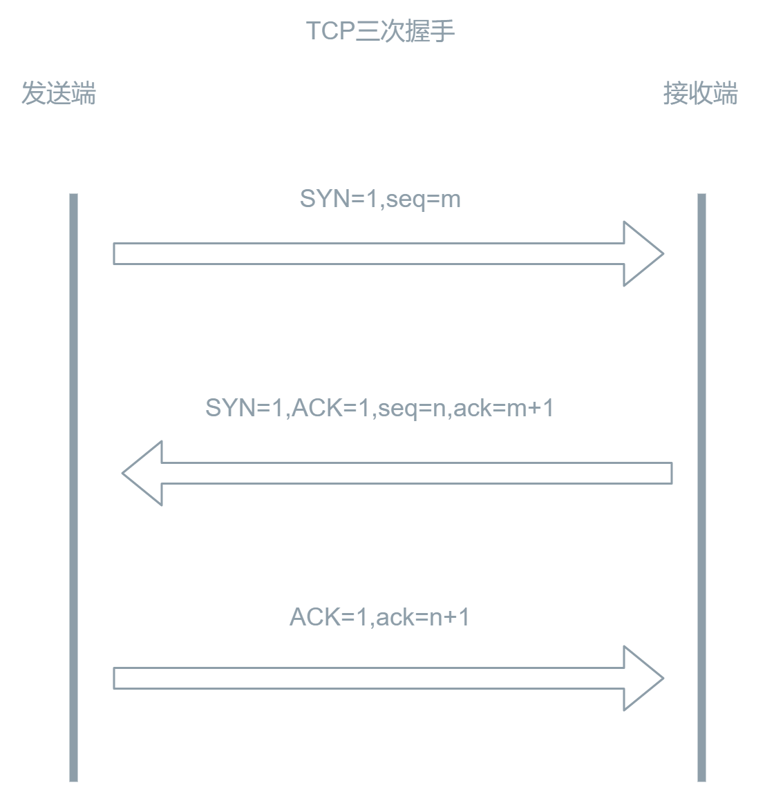
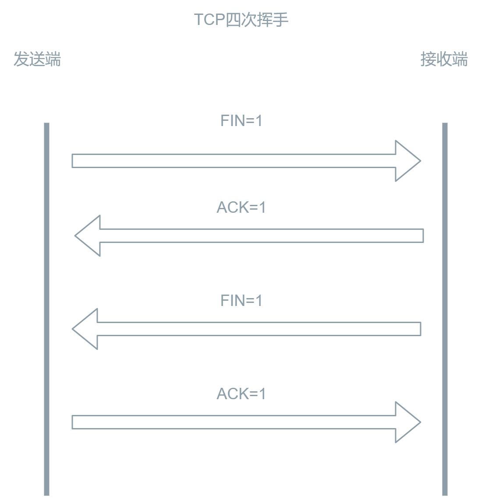

# 计算机网络

## HTTP请求方法？GET和POST的区别？

HTTP（Hypertext Transfer Protocol 超文本传输协议）定义了一组不同的请求方法，也称为HTTP请求方法或HTTP动词，用于指定对服务器执行的操作。以下是一些常见的HTTP请求方法：

1. GET：用于请求指定资源，只从服务器获取数据，不对服务器上的资源进行任何更改。GET请求可以被缓存，可以被书签保存，以及被历史记录保存，通常用于获取数据。
2. POST：向服务器提交数据，用于向指定资源提交数据，数据被包含在请求体中。POST请求不会被缓存，不会保留在浏览器历史记录中，通常用于向服务器发送数据，如表单提交。
3. PUT：用于向服务器上传新的实体，取代指定资源的内容。
4. DELETE：删除指定的资源。
5. PATCH：对资源进行部分修改。
6. HEAD：类似于GET请求，但服务器只返回请求头信息，不返回实体主体内容。
7. OPTIONS：用于获取目标资源所支持的通信选项。
8. TRACE：回显服务器收到的请求，用于测试或诊断。

GET 和 POST 的区别：

1. POST相对GET来说更安全。由于HTTP协议是明文传输的，两者其实都不安全。GET请求参数直接挂载在URL上，可以被用户看见，而POST则放在请求体中；GET请求记录可以被保存在浏览器或web服务器日志中，而POST则不会。因此，相对来说POST请求更加安全一些。
2. GET请求可以缓存，POST不能缓存。
3. GET请求有长度限制，POST没有。GET请求本身没有长度限制，但是不同浏览器对URL有长度限制不同。
4. GET请求只能传输字符数据，POST可以传输多种类型的数据。GET请求是挂载在URL上的，所以传输的数据类型只能是字符串，但是POST请求可以传输除字符串以外的数据，比如：视频，声音，图片，文档等。
5. GET只发送一个数据包，POST可能会产生两个数据包。GET任何情况下都会一次性将请求头和请求体发送完成，POST**有些情况下**（取决于浏览器/发送方、版本）会先将请求头发送给服务器，确认服务器可以响应并且具备接收数据的能力，此时响应100，接着再发送请求体，如果服务器没有响应100那么就不会继续发送请求体。
7. 刷新和回退时GET请求无害，POST请求的数据会被重新提交。无害是指对数据的影响，GET请求一般用于获取数据，例如静态自愿获取等，页面刷新后可能会使用到缓存，而POST请求多数用于数据的修改，默认情况下可能每次执行都会影响服务端的数据，相比较来说GET比POST更加无害。

## 什么是HTTP持久连接（keep-alive）？ 它如何工作？

HTTP持久连接（HTTP Keep-Alive）是一种在单个TCP连接上可以发送和接收多个HTTP请求和响应的机制。在传统的HTTP/1.0协议中，每次请求都需要建立一个新的TCP连接，请求完成后立即关闭连接，这样会增加服务器和客户端之间建立和断开连接的开销。而HTTP/1.1协议默认支持持久连接，可以在同一个TCP连接上发送多个请求和响应，从而减少了连接建立和断开的开销，提高了性能和效率。

**工作原理**：

1. 建立连接：客户端向服务器发送一个HTTP请求，服务器接收到请求后不立即关闭连接，而是保持连接处于打开状态。

2. 发送多个请求：在保持连接的状态下，客户端可以继续发送其他HTTP请求，而无需重新建立新的TCP连接。

3. 接收多个响应：服务器在保持连接的状态下可以连续发送多个HTTP响应，每个响应对应一个请求。

4. 保持连接时间：HTTP持久连接可以在一定的时间内保持打开状态，超过一定时间或达到一定数量的请求后，连接可能会被关闭。

**优点**：

1. 减少延迟：避免了重复建立和关闭连接的开销，减少了请求和响应之间的延迟。

2. 减少资源消耗：减少了服务器和客户端资源的消耗，提高了系统的性能和效率。

3. 提高并发性：通过复用TCP连接，可以在同一时间内处理多个HTTP请求，提高了并发处理能力。

4. 改善用户体验：减少了页面加载时间，提高了网站的响应速度，改善了用户体验。

总的来说，**HTTP持久连接通过复用TCP连接，减少了连接建立和断开的开销，提高了性能和效率**，是一种提高网络通信效率的重要机制。

::: tip
持久连接带来了“队头阻塞”问题：如果某个请求因为某种原因被阻塞，那么后续的请求也会被阻塞，从而导致页面加载速度下降。它在HTTP/2.0中得以解决。
:::

## 常见的HTTP状态码分别代表什么意思？

**1XX消息状态码**：

- 100：Continue 继续。客户端应继续其请求。

- 101：Switching Protocols 切换协议。服务器根据客户端的请求切换协议。只能切换到更高级的协议，例如，切换到 HTTP 的新版本协议。

**2XX成功状态码**：

- 200：OK 请求成功。一般用于 GET 与 POST 请求。

- 201：Created 已创建。成功请求并创建了新的资源。

- 202：Accepted 已接受。已经接受请求，但未处理完成。

- 203：Non-Authoritative Information 非授权信息。请求成功。但返回的 meta 信息不在原始的服务器，而是一个副本。

- 204：No Content 无内容。服务器成功处理，但未返回内容。在未更新网页的情况下，可确保浏览器继续显示当前文档。

- 205：Reset Content 重置内容。服务器处理成功，用户终端（例如：浏览器）应重置文档视图。可通过此返回码清除浏览器的表单域。

- 206：Partial Content 部分内容。服务器成功处理了部分 GET 请求。

**3XX重定向状态码**：

- 300：Multiple Choices 多种选择。请求的资源可包括多个位置，相应可返回一个资源特征与地址的列表用于用户终端（例如：浏览器）选择。

- 301：Moved Permanently 永久移动。请求的资源已被永久的移动到新 URI，返回信息会包括新的 URI，浏览器会自动定向到新 URI。今后任何新的请求都应使用新的 URI 代替。

- 302：Found 临时移动，与 301 类似。但资源只是临时被移动。客户端应继续使用原有URI。

- 303：See Other 查看其它地址。与 301 类似。使用 GET 和 POST 请求查看。

- 304：Not Modified 未修改。所请求的资源未修改，服务器返回此状态码时，不会返回任何资源。客户端通常会缓存访问过的资源，通过提供一个头信息指出客户端希望只返回在指定日期之后修改的资源。

- 305：Use Proxy 使用代理。所请求的资源必须通过代理访问。

- 307：Temporary Redirect 临时重定向。与 302 类似,使用 GET 请求重定向。

**4XX客户端错误状态码**：

- 400：Bad Request 客户端请求的语法错误，服务器无法理解。

- 401：Unauthorized 请求要求用户的身份认证。

- 402：Payment Required 保留，将来使用。

- 403：Forbidden 服务器理解请求客户端的请求，但是拒绝执行此请求。

- 404：Not Found 服务器无法根据客户端的请求找到资源（网页）。通过此代码，网站设计人员可设置"您所请求的资源无法找到"的个性页面。

- 405：Method Not Allowed 客户端请求中的方法被禁止。

- 406：Not Acceptable 服务器无法根据客户端请求的内容特性完成请求。

- 408：Request Time-out 服务器等待客户端发送的请求时间过长，超时。

**5XX服务端错误状态码**：

- 500：Internal Server Error 服务器内部错误，无法完成请求。

- 501：Not Implemented 服务器不支持请求的功能，无法完成请求。

- 502：Bad Gateway 作为网关或者代理工作的服务器尝试执行请求时，从远程服务器接收到了一个无效的响应。

- 503：Service Unavailable 由于超载或系统维护，服务器暂时的无法处理客户端的请求。延时的长度可包含在服务器的Retry-After头信息中。

- 504：Gateway Time-out 充当网关或代理的服务器，未及时从远端服务器获取请求。

- 505：HTTP Version not supported 服务器不支持请求的HTTP协议的版本，无法完成处理。

## HTTP1.0 HTTP1.1 HTTP2.0 之间的区别？

**HTTP/1.0**：

- 连接管理：每个请求/响应周期都需要创建新的TCP连接，因为 HTTP/1.0 默认不支持复用连接。
- 头部阻塞：在一个连接上只能进行一个请求，直到请求完成后，才能发送下一个请求。这意味着在一个请求的响应全部返回之前，后续的请求必须等待。
- 无状态：HTTP/1.0 默认是无状态的，每个请求/响应周期都是相互独立的。

**HTTP/1.1**：

- 持久连接：**默认开启**持久连接（keep-alive），允许多个请求/响应可以在一个TCP连接上复用，减少了TCP连接的建立和关闭次数。
- 管道化：允许在一个连接上同时发送多个请求，但是响应仍然要按照请求的发送顺序返回。
- 主机头部：支持在头部中包含主机信息，一个服务器可以托管多个域名的网站。
- 缓存控制：引入更多缓存控制的头部，包括ETag、If-Modified-Since等，增加了缓存的效率。

**HTTP/2.0**：

- 多路复用：允许在一个连接上同时发送多个请求和响应，避免了头部阻塞，提高了性能。
- 头部压缩：HTTP/2.0 使用 HPACK 算法对头部进行压缩，减少了数据传输的开销。
- 服务器推送：服务器可以在客户端请求之前就主动向客户端推送资源。
- 优先级：允许客户端指定和优先级相关的资源请求，提高了网络资源利用率。

总的来说，HTTP/1.1 相对于 HTTP/1.0 做了一些重要的改进，引入了持久连接和管道化请求，性能有了明显的提升。而 HTTP/2.0 则进一步提高了性能，引入了多路复用、头部压缩等新特性，使得网络通信更加高效。

## HTTP和HTTPS的区别？

- HTTPS = HTTP + TLS/SSL，是更加可靠安全的传输协议。

- HTTP默认端口是80，HTTPS默认端口是443。

## HTTPS如何保证传输的安全性？

1. 加密传输： 通过使用TLS/SSL协议加密数据传输（对称加密和非对称加密的混合加密），这意味着在数据传输过程中，第三方无法轻易窃听、篡改或伪造数据。

2. 身份认证： HTTPS使用TLS/SSL证书进行服务器身份验证，确保数据发送到正确的服务器。

3. 数据完整性校验： HTTPS在通信过程中使用摘要函数（如HMAC）来验证数据的完整性，确保数据在传输过程中没有被篡改。

## 什么是CDN？基本的工作原理是怎么样的？使用CDN有哪些优劣？

CDN是内容分发网络（Content Delivery Network）的缩写，它是由分布在不同地理位置的服务器群组成的网络，旨在更快、更可靠地提供互联网内容。

工作原理： 将源站的资源缓存到位于全球各地的 CDN 节点上，用户请求资源时，就近返回节点上缓存的资源，而不需要每个用户的请求都回您的源站获取，避免网络拥塞、缓解源站压力，保证用户访问资源的速度和体验。

**使用CDN的优点**包括：

1. 加速页面加载速度：通过将内容提供给用户最近的节点，减少了网络延迟，从而加速了页面加载速度。
2. 减轻源服务器负载：CDN可以减少源服务器的负载，提高了网站的整体稳定性。
3. 增强安全性：一些CDN提供了安全防护功能，能够缓解分布式拒绝服务（DDoS）攻击等威胁。

**使用CDN的劣势**可能包括：

1. 成本：使用CDN可能会增加运营成本，尤其是针对小型网站或流量较低的情况。
2. 配置复杂性：配置CDN可能需要一定的技术和时间投入，对于非技术人员来说可能显得复杂。
3. 隐私和安全风险：CDN节点托管的内容可能会面临一些隐私和安全风险，因此需要仔细选择信誉良好的CDN服务商。

## 什么是DNS？有什么用？解析过程是怎么样？

DNS（Domain Name System，域名系统）是互联网中用于将域名（如example.com）转换为对应IP地址的分布式命名系统。它充当了互联网的"电话簿"，将易于记忆的域名映射到计算机能够理解的IP地址。

DNS的主要用途包括：

1. 名解析：将用户输入的域名转换为对应的IP地址，以便建立与服务器的通信连接。

2. 负载均衡：DNS可以通过返回多个IP地址，将请求分发到不同的服务器上，以实现负载均衡，提高网站的性能和可靠性。

3. 故障转移：当某个服务器不可用时，DNS可以将请求重定向到备用服务器，实现故障转移，确保服务的连续性。

4. 反向解析：将IP地址转换为对应的域名，用于确定访问者的来源。

DNS解析过程一般包括以下步骤：

1. 本地解析器查询：用户的计算机首先向本地解析器（通常是ISP提供的DNS服务器）发送域名查询请求。

2. 递归查询：如果本地解析器没有缓存该域名的IP地址，它将从根域名服务器开始递归查询。根域名服务器指导本地解析器到达顶级域名服务器。

3. 迭代查询：顶级域名服务器返回指向下一级域名服务器的信息，本地解析器继续向下一级域名服务器发起查询请求。

4. 最终解析：本地解析器最终获得目标域名的IP地址，并将其返回给用户的计算机。

简单来讲： 本地DNS服务器查询 -> 根域名服务器查询 -> 顶级域名服务器查询 -> 目标域名服务器查询

## TCP和UDP的区别？它们各自应用的场景？

TCP和UDP都是网络传输协议，属于OIS七层模型或者TCP/IP模型中的传输层。

区别： 

1. TCP是面向数据报的协议，而UDP是面向字节流的协议。

2. TCP提供可靠的数据传输，通过序号、确认和重传机制来确保数据的完整性和可靠性，如果数据丢失或损坏，TCP会重新发送。而UDP不保证可靠性，它只是简单地把数据包发送出去，不关心数据是否被接收，也不会重传丢失的数据包。

3. TCP有连接，通信双方在数据传输之前需要建立连接，然后进行数据传输，最后释放连接。UDP无连接，通信双方之间不需要建立持久的连接，可以直接发送数据包。

4. TCP传输效率较低，UDP传输效率较高。

应用场景：

TPC: 常用于需要可靠数据传输和顺序传送的应用，如网页浏览、文件下载、电子邮件传输等。

UDP: 常用于实时性要求较高、数据量较小且能够容忍丢包的应用，如实时音视频传输、在线游戏等。

## 描述TCP的三次握手和四次挥手？为什么断开连接是四次挥手？

三次握手：

1. 客户端发送一个带有SYN（同步）标志的数据包给服务器，表示请求建立连接，并选择一个初始序列号（ISN）。

2. 服务器收到客户端的SYN包后，会回复一个带有SYN和ACK（确认）标志的数据包给客户端，表示收到了客户端的请求，并同意建立连接，同时也选择一个初始序列号。

3. 客户端收到服务器的SYN和ACK包后，会发送一个带有ACK标志的数据包给服务器，表示收到了服务器的确认，连接建立完成。

四次挥手：

1. 客户端发送一个带有FIN（结束）标志的数据包给服务器，表示数据发送完成，请求断开连接。

2. 服务器收到客户端的FIN包后，会回复一个带有ACK标志的数据包给客户端，表示收到了客户端的请求，但服务器仍有数据需要发送。

3. 服务器发送一个带有FIN标志的数据包给客户端，表示服务器也准备好断开连接。

4. 客户端收到服务器的FIN包后，会回复一个带有ACK标志的数据包给服务器，表示收到了服务器的请求，连接断开。

断开连接是四次挥手的原因是因为在TCP连接中，通信双方可以同时发送和接收数据，当一方要断开连接时，需要先停止发送数据，但仍然需要等待对方所有尚未发送的数据都接收完成，才能确认连接断开。因此，需要四个步骤来完整地关闭连接，确保数据的可靠传输和连接的正确关闭。

## TCP如何保证传输的可靠性？

通过以下方式来保证数据传输的可靠性：

- 序列号和确认机制：TCP在每个数据包中都使用序列号来标识发送的数据段，在接收端利用确认号来表明收到的数据段。通过序列号和确认机制，发送端可以知道哪些数据段已经被成功传输，哪些需要进行重传。

- 超时重传：如果发送端在一定时间内没有收到对方的确认，就会触发超时重传机制，重新发送没有得到确认的数据包。

- 流量控制：TCP使用滑动窗口机制来进行流量控制。接收方可以通知发送方自己的缓冲区大小，以避免过多的数据超出它的处理能力。

- 拥塞控制：TCP使用拥塞避免和拥塞控制机制来避免网络拥塞，通过动态调整发送窗口和慢启动等算法实现对网络拥塞的敏感性调节。

- 确认机制：TCP中的确认机制保证了数据包的可靠传输。接收方会对接收到的数据包发送确认信息，以确保发送方可以知道数据是否已经成功传输。

- 分段和重组：TCP会将数据流分成适当的数据段，并在接收端进行重组，以保证数据的完整性和正确性。

## TCP的拥塞控制机制是怎么样的？

TCP的拥塞控制机制旨在避免网络拥塞并调整数据传输速率，以确保网络流量和数据包不会超出网络的承载能力，从而维持整个网络的稳定性。TCP拥塞控制的主要算法包括慢启动、拥塞避免、快重传和快恢复。

- 慢启动（Slow Start）：慢启动是TCP连接刚开始发送数据时使用的算法。发送方会以指数增长的速率增加发送窗口大小，从而有效地探测网络的容量，直到达到一个阈值（拥塞避免阈值）。

- 拥塞避免（Congestion Avoidance）：一旦达到拥塞避免阈值，发送方就会进入拥塞避免阶段。在该阶段，发送方以较慢的线性增长速率增加发送窗口大小，以更稳健地应对网络拥塞。

- 快重传（Fast Retransmit）：在接收方发现丢失的连续数据包时，它会立即发送重复确认，以通知发送方有数据包丢失。发送方在收到三个重复确认时会立即重传丢失的数据包，而不必等到超时。

- 快恢复（Fast Recovery）：快恢复是一个与快重传相关的机制，当发送方收到三个重复确认时，不会像慢启动一样将拥塞窗口减半，而是将拥塞窗口减小到一半，然后慢慢增加，以便更快地恢复到之前的发送速率。

通过这些机制，TCP可以动态地调整发送窗口的大小，以适应网络的状况，从而避免网络拥塞，保证数据的可靠传输。拥塞控制机制在TCP中扮演着重要的角色，确保网络的稳定性和公平性。

## Websocket协议的特点是什么？

WebSocket协议是一种在单个TCP连接上进行全双工通信的协议，其特点包括：

- 全双工通信：WebSocket允许客户端和服务器之间进行全双工通信，即双方可以同时发送和接收数据，通信效率高，而不像HTTP协议那样需要客户端首先发送请求，服务器才能响应。

- 低延迟：由于WebSocket建立在单个TCP连接上，并且不需要在每次通信中重新建立连接，因此可以降低通信的延迟，使得实时性要求较高的应用（如在线游戏、实时聊天等）更加高效。

- 减少数据传输量：与HTTP协议相比，WebSocket在建立连接时只需要发送一次握手信息，之后可以直接传输数据，不需要每次通信都发送完整的HTTP头部信息，减少了通信时的数据传输量。

- 支持跨域通信：WebSocket协议支持跨域通信，可以通过在HTTP协议头部添加特定的字段（如Origin）来实现跨域连接，从而满足不同域名下的客户端和服务器进行通信的需求。

- 实现简单：WebSocket协议相对于其他实时通信技术（如长轮询、Comet等）实现更为简单，客户端和服务器只需实现一次连接握手，之后即可直接进行数据传输。

- 支持扩展：WebSocket协议支持通过扩展来增加新的功能和特性，例如压缩、安全认证等，可以根据实际需求进行定制。

总的来说，WebSocket协议的主要特点可以概括为**全双工、长连接、高效率**，适用于需要高效、实时性的网络应用场景。

## 描述Websocket的握手过程？

WebSocket的握手过程是在客户端和服务器之间建立WebSocket连接时的一系列协商步骤。以下是WebSocket协议的握手过程简要描述：

1. 客户端发起握手请求：客户端首先发送一个HTTP请求，该请求包含了Upgrade头部字段，字段值为"websocket"，还包含了Connection头部字段，字段值为"Upgrade"，同时还会携带一个 Sec-WebSocket-Key 字段，该字段的值是一个经过Base64编码的随机字符串。
服务器进行握手确认：

2. 服务器接收到客户端的握手请求后，会检查请求头中的Upgrade和Connection字段，如果符合WebSocket协议的握手规范，服务器会发送一个HTTP 101状态码（Switching Protocols）作为响应，同时回复一个Sec-WebSocket-Accept字段，该字段的值是经过一定计算规则生成的内容，用于确认握手有效性。在这个过程中，服务器也可以携带其他附加的头部字段来进行扩展或其他设置。
握手完成：

3. 客户端收到带有101状态码的响应后，会验证服务器返回的Sec-WebSocket-Accept字段，以确认握手有效性。如果验证成功，客户端和服务器之间的连接就正式完成，随后的通信就会基于WebSocket协议进行，而不再使用普通的HTTP协议进行通信。

这样，通过握手过程，客户端和服务器就建立了WebSocket连接，之后可以进行双向通信，实现实时的数据传输和交互。整个握手过程确保了连接的建立和协议的切换，使得客户端和服务器可以进行更高效的通信。

## Websocket如何处理心跳和断线重连？

在WebSocket通信中，心跳和断线重连是常见的机制，用于维持连接的稳定性和可靠性。下面是关于WebSocket如何处理心跳和断线重连的一般做法：

**心跳机制**：

- 心跳包发送：客户端和服务器可以约定一个心跳间隔时间，客户端定时向服务器发送一个特定的心跳包（通常是一个空的数据包），以保持连接的活跃状态。

- 心跳响应：服务器收到心跳包后，会回复一个特定的响应包，表示连接仍然有效。如果客户端在一定时间内没有收到心跳响应，可以视为连接出现问题，可以触发断线重连机制。

**断线重连机制**：

- 重连尝试：当客户端检测到连接断开（比如长时间未收到心跳响应），可以尝试重新建立连接。客户端可以根据一定的策略进行重连尝试，比如定时重连、指数退避重连等。

- 状态恢复：在重新建立连接后，客户端可能需要进行状态恢复，比如重新订阅频道、重新发送未成功发送的消息等，以确保连接恢复后能够继续正常工作。

通过心跳机制和断线重连机制，WebSocket可以保持连接的稳定性和可靠性，确保在网络不稳定或出现断线情况时能够及时恢复连接，保证通信的持续进行。

## Websocket和长轮询、短轮询有什么区别？

WebSocket、长轮询（Long Polling）和短轮询（Short Polling）都是用于在客户端和服务器之间进行实时通信的技术，它们之间的主要区别如下：

**WebSocket**：

- 双向通信：WebSocket提供了全双工的通信机制，客户端和服务器可以同时发送和接收数据，实现了实时的双向通信。

- 持久连接：WebSocket通过一次握手建立连接后，可以保持长时间的连接状态，避免了频繁地建立和断开连接，从而减少了通信开销。

- 低延迟：由于是持久连接且支持双向通信，WebSocket可以实现低延迟的实时通信，适用于需要高实时性的应用场景。

**长轮询（Long Polling）**：

- 单向通信：长轮询是一种单向的通信方式，客户端发送请求给服务器后，服务器会保持连接打开，直到有新数据可用或超时才返回响应给客户端。

- 不断开连接：在长轮询中，客户端的连接会一直保持打开状态，直到服务器有数据响应或超时，然后客户端会重新发送请求建立下一次轮询。

- 高延迟：由于每次请求都需要等待服务器返回数据或超时，长轮询可能会导致较高的延迟，特别是在数据更新不频繁时。

**短轮询（Short Polling）**：

- 轮询频繁：短轮询是一种频繁向服务器发送请求的方式，客户端定时发送请求询问服务器是否有新数据，然后服务器立即返回响应。

- 无状态：每次请求都是独立的，客户端和服务器之间不保持连接状态，因此每次请求都需要重新建立连接。

- 高带宽消耗：由于频繁发送请求，短轮询可能会导致较高的带宽消耗，特别是在数据更新频繁时。

总的来说，WebSocket适用于需要实时双向通信、低延迟的场景；长轮询适用于需要实时性较强但数据更新不频繁的场景；短轮询适用于对实时性要求不高、数据更新频繁但数据量较小的场景。选择合适的通信方式取决于具体应用的需求和场景特点。