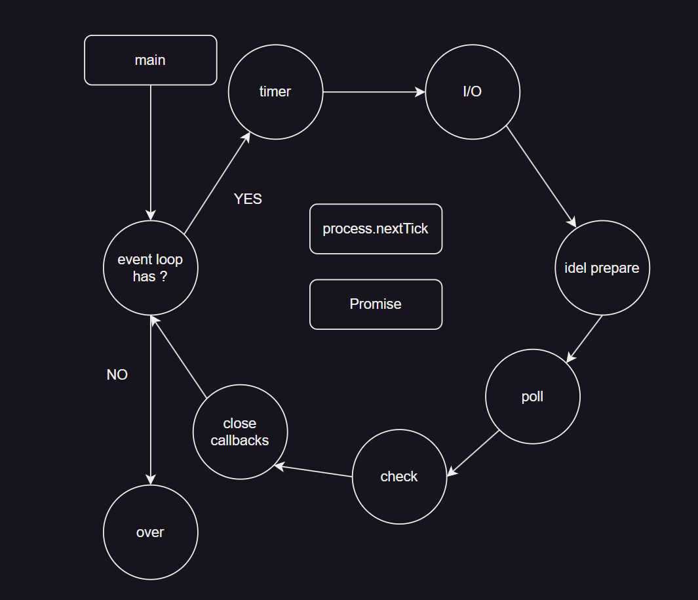

### vue 和 react 的响应式

Vue2.x 是依赖Object.defineProperty()实现响应式，缺点是无法劫持属性的删除和添加，对于数组也无法监听到变化，同时深层对象的递归劫持有较大的性能损耗。

Vue3 则是借助ES6新增的Proxy API 对对象属性进行劫持从而实现响应式，同时可以监听数组的变化。

React的响应式是依赖于虚拟DOM的DIFF算法以及自顶向下的单向数据流，当组件的内部的state发生变化，通过对比前后虚拟DOM从而触发render函数进行UI的变更。

### window load 和 document ready的区别

window.load事件是再整个页面以及所有依赖资源例如样式表和图片等都加载完时触发。

Jquery中的document ready事件是在DOM树加载完时触发，不必等待其他依赖资源的加载。


## 3.22 杭州公司面试

### 事件冒泡？列表中删除元素时绑定事件怎么处理？
标准事件模型分三个阶段：事件捕获/事件处于目标阶段/事件冒泡
列表删除元素时避免为每一个元素注册点击事件而造成性能损耗，可以在它们的父元素上监听事件，借助事件冒泡，在父元素上接收事件后根据元素的id进行删除操作。

### rem和px的区别，好处？UI给出的图是px的，如何转换成rem?

### react中setState直接传入值和传入回调函数的区别？

由于setState在React组件的生命周期和合成事件中是异步更新的（代码同步执行）的，它无法对当前快照的变量进行修改,在下一次更新前setState中永远都是旧的值用于计算；而如果传入的是回调函数，在连续多次调用它们时React会将这些setState放入一个队列中批量处理，在下一次更新前按照顺序执行队列中的回调函数，前一个回调的结果作为新的状态被下一个回调接收，直到队列执行完毕得到最终的新值。

### useeffect的setup函数返回的cleanup函数什么时候执行？

- 依赖数组中的值发生改变，会先使用旧的props和state执行一次cleanup，再使用新的props和state执行setup函数。
- 组件卸载的时候最后执行一次

### useRef为什么能作缓存？

useRef的本质就是引用，它总能拿到最新值。useRef创建的对象会存放在对应的组件Fiber上，在组件的生命周期内都不会改变。

### useContext的用法？有什么问题？

创建上下文，用于跨层级共享状态.

消费了Context的组件会在value变化时重新渲染，如果有很多个组件同时消费一个context并且context的值是经常变化的，那么就有性能问题。
为了避免不必要的重复渲染，可以使用useMemo和useCallback对值和函数进行缓存，或者粒度化Context，将一个Context拆分成一个个小的Context,只有消费了相应Context的组件在value变化时才更新。

### React Diff算法？

DIFF算法的目的就是通过对比新旧的虚拟DOM树得出差异并以性能损耗最小的方式进行更新。

React的Diff策略：三个层次，同级比较。

React只会比较新旧DOM树的同级节点，在Tree层次的比较时，不进行移动操作，如果相同位置的节点发生变化只进行删除和新增操作。（相比于创建和删除，移动操作有更大的性能损耗）。在组件层次比较时，会尽可能复用节点，例如某个节点发生改变但是它的子树没有变化，那么只需要更新发生改变的节点而子树复用。在元素层次比较时（例如列表），依赖于唯一标识Key来进行移动/删除操作,采用右移策略。

### zustand的原理？为什么在组件A修改了store中的state，组件B的UI也会更新？
 zustand = 发布订阅 + useSyncExternalStore
 zustand内部通过发布订阅模式来实现状态改变的通知，通过是使用useSyncExternalStore来让React可以订阅到zustand的内部状态并在状态改变时改变视图。

### next.js创建的是多页应用还是单页？SSR有实践吗？怎么理解SSR？

next.js创建的应用是多页还是单页取决于使用什么方式来编写，如果是用服务端渲染的方式，通过服务器返回HTML结构的可以看作是多页应用，如果依赖浏览器解析并且页面的切换不会请求新的HTML的而是局部更新的则是单页应用。

SSR就是将浏览器解析处理HTML的工作放在服务器上来做，服务器在处理完成后将HTML字符串返回给浏览器，浏览器再对HTML字符串进行解析，将相应的事件注册和绑定（水合），最终渲染出来。

优点： 更快的首屏加载速度和更好的可访问性（SEO）

### 依赖json schema的动态表单中的表单项联动怎么做？


## 3.29 宁波公司面试

### React 16 17 18 等各个版本的区别？

React 15 中使用reconceiler(协调器)来进行diff找到变化节点后通知renderer渲染 递归更新子组件

React 16 :

相较于15版本有重大的更新，包括新的特性/新的Fiber架构/Hooks。

- 支持返回字符串和数组。16以前render函数只能返回一个元素，如果需要返回多个元素就要再外层包裹一层div,16中就不需要。
- 新增componentDidCatch生命周期和getDerivedStateFromError方法，可以捕获组件内部错误而不会导致页面崩溃。
- 新增createPortal方法，可以将组件渲染到指定的DOM节点上。
- 新增Fragment，可以用来替代div但是不会渲染到页面上，避免了添加额外的节点。
- 新增createRef/forwardRef用于转发ref，可以将ref传递给子组件。
- 新增context api 用于跨层级传递数据。
- 新增Strict Mode 用于检测项目中可能出现的问题。
- 新增memo组件用于优化性能。
- 新增lazy/suspense api 用于实现懒加载。
- 16.8中引入了hooks, 让函数组件可以拥有状态，实现和类组件相同的功能。

React 17 :

相较于16版本，17更多的是对16的优化。

- 移除事件池机制。16中事件处理函数是异步执行的，这会导致它内部获取不到事件对象，为了避免事件对象被回收，需要使用event.persist()来获取它，而17中事件处理函数是同步执行的，可以直接使用事件对象。
- 更改了事件委托的根节点。所有的事件都绑定再root element上，而16中都绑定再html元素上，避免多个react应用嵌套可能造成的冲突。
- 新增JSX转换器，可以在不引入React的情况下使用JSX语法。
- 副作用的清理时机。 17之前的useEffect的cleanup函数是同步执行的，这可能会减缓屏幕的过渡（例如切换标签），17中的cleanup函数是异步执行的，组件卸载后，cleanup会在屏幕更新后执行。另外，react17中会在任何新的副作用执行之前执行所有的cleanup函数（针对所有组件），而16中这种顺序只在组件内部得以保证。
- 返回一致的undefined错误，17中不仅对函数组件和类组件返回undefined进行报错，同时也对forwardRef和memo返回undefined进行报错。


React 18 :

相较于17版本，18引入了并发模式、自动批处理、更多的hooks、SSR的支持。

- 新增Concurrent Mode （并发模式）并默认开启，让渲染更加流畅。在16.8之前，state改变后经过一系列的处理进入diff过程。diff采用了DFS来遍历虚拟DOM树，这个过程是一次性完成的，而当应用很复杂元素很多时，diff过程就会长时间占用主线程。如果diff比较的时间超过16.6ms就会出现掉帧，如果时间更长则会造成卡顿。而在并发模式下，diff是可以中断的。如果diff时间超过5ms，React就会将主线程交还给浏览器去渲染，当空闲的时候，利用事件循环机制恢复diff。并发模式下的中断和恢复机制是scheduleri提供的。

```jsx
// v17
import ReactDOM from 'react-dom'
import App from './App'

ReactDOM.render(<App />, document.getElementById('root'))

// v18
import ReactDOM from 'react-dom/client'
import App from './App'

ReactDOM.createRoot(document.getElementById('root')).render(<App />)

```

1. 实现自动批处理。自动批处理就是将多次的状态更新聚合到一次render中执行避免多次重新渲染以提升性能。17版本中的批处理只在事件处理函数中实现，而在异步代码、原生事件处理函数中失效，18版本则优化为所有的更新都会自动进行批处理。（如果某些场景不需要批处理，可以使用flushSync强制同步更新，flushSync是以函数为作用域，内部如果有多个setState依然是批量更新）。
2. Suspense支持SSR。SSR页面渲染流程：服务器获取页面所需要的数据->将组件渲染成HTML字符串并返回给客户端->客户端通过水合将HTML字符串渲染成页面。这一过程是串行的，18版本之前的SSR不允许组件等待数据，必须得所有得数据都收集完成才会向客户端响应HTML，如果其中某一环节比较耗时，整体得渲染速度就会变慢。18版本中使用并发渲染特性拓展了Suspense,支持流式SSR，也就是将组件分割成更小得块，允许服务器一点一点响应HTML，尽早发送HTML和选择性地水合，从而提高页面地加载速度。
3. 新增了startTransition。这个方法可以将更新作为一个transition，React会将它视为可中断任务，允许用户在不阻塞UI地情况下更新状态。本质上用于一些不紧急的更新上，用来进行并发控制。
4. 新增了useTransition。这个hook提供了一个变量isPending和startTransition，isPending用于追踪transition的状态。
5. useDeferredValue。它和useTransition一样都是标记一次非紧急更新，不同的是useTransition处理一段逻辑，而它是产生一个新的状态，这个状态是延时的，因此它可以推迟状态的渲染。
6. 新增useId。这个hook支持同一个组件在客户端和服务端生成相同的ID，避免水合的不匹配，原理就是每个ID代表了该组件在组件树中的层级结构。 
7. 新增useSyncExternalStore。一般是第三方状态管理使用，它通过强制的状态同步更新，使得外部store可以支持并发读取。它实现了对外部数据源订阅时不再需要useEffect。
8. 新增useInsertionEffect。仅限于 css-in-js 库使用。它允许 css-in-js 库解决在渲染中注入样式的性能问题。 执行时机在 useLayoutEffect 之前，只是此时不能使用 ref 和调度更新，一般用于提前注入样式。


### 说一下Fiber Node？为什么Fiber要使用链表结构？


Fiber就是React内部实现的用于状态更新的数据结构，支持优先级调度和异步可中断。

Fiber Node是Fiber树的最小单元，一个Fiber Node对应一个React Element,同时它也是一个最小的工作单元，保存了节点的属性、更新变化、hooks、父节点/子节点/兄弟节点的引用等等。

Fiber实现了双缓存机制，也就是说同时存在两个Fiber树，一个current fiber树和一个workInProgress fiber树，current树用于当前的渲染更新，另一个在内存中用于下一次更新，当某个Node发生变化后且workInProgress树更新完后，fiberRootNode就会指向workInProgress树的rootFiber，这样workInProgress树就变成了current树，同时之前的current树就成为了workInProgress树。


```js
// 源码
function FiberNode(
  this: $FlowFixMe,
  tag: WorkTag,
  pendingProps: mixed,
  key: null | string,
  mode: TypeOfMode,
) {
  // Instance
  this.tag = tag;
  this.key = key;
  this.elementType = null;
  this.type = null;
  this.stateNode = null;

  // Fiber Node和Fiber Node之间的关系
  // Fiber
  this.return = null; // 父节点
  this.child = null;
  this.sibling = null;
  this.index = 0;

  this.ref = null;
  this.refCleanup = null;

  this.pendingProps = pendingProps;
  this.memoizedProps = null;
  this.updateQueue = null; //更新队列，该节点内部的更新顺序
  this.memoizedState = null;
  this.dependencies = null;

  this.mode = mode;

  // Effects
  this.flags = NoFlags;
  this.subtreeFlags = NoFlags;
  this.deletions = null;

  this.lanes = NoLanes;
  this.childLanes = NoLanes;

  this.alternate = null; // 指向内存中的workInProgressFiber树对应的Node
}


```

### 说一下Nodejs中的事件循环？它和浏览器中的事件循环有什么区别？

区别：
1. 浏览器的事件循环是根据HTML标准实现的，而nodejs中的事件循环是基于libuv实现的。libuv是一个C语言实现的高性能解决单线程非阻塞异步 I/O 的开源库，它本质上是对常见操作系统底层异步I/O操作的封装，nodejs底层就是调用它的API。
2. 浏览器中的事件循环和Nodejs中的事件循环都将异步任务划分为宏任务和微任务。
  浏览器微任务： Promise.then() 、 MutationObserver。
  浏览器宏任务： setTimeout/setInterval、 script（整体代码） 、 UI事件 、Postmessage 、 MessageChannel。
  NodeJS微任务： Promise.then、process.nestTick。
  NodeJS宏任务： setTimeout、setInterval、 setImmediate、script（整体代码）、 I/O 操作。


浏览器中的事件循环：首先脚本本身的执行就是一个宏任务，在执行同步代码时遇到微任务就将它加入微任务队列（FIFO），遇到宏任务就加入宏任务队列(FIFO)，当本次脚本的同步代码执行完毕（卡可以看作是一个宏任务结束），就查看微任务队列并依次执行，执行一个微任务就移除微任务队列直到微任务队列执行完毕；接着查看宏任务队列，依次执行。整体执行效果就是一个循环，宏任务->微任务。

NodeJS中的事件循环：划分为六个阶段，也就是有六个宏任务队列，而微任务队列有两个process.nextTick队列和Promise队列，它们在进入下一个阶段前必须依次反复清空，直到两个队列完全没有即将到来的任务的时候再进入下一个阶段。process.nextTick队列的优先级高于Pormise队列。

1. timer阶段。执行setTimeout/setInterval的回调，由poll阶段控制。
2. I/O callbacks阶段。处理上一轮循环poll阶段中未执行而延迟的I/O回调。
3. idle/prepare阶段。仅Node内部使用。
4. poll阶段。回到timer阶段执行回调，然后执行I/O回调。在进入poll阶段之前会计算poll阶段的超时时间。如果poll队列有回调任务，依次执行直到队列清空；如果poll队列中没有回调任务，则判断：如果有setImmediate回调需要执行，poll阶段会结束并进入check阶段；如果没有setImmediate回调需要执行，会等待其他队列的回调被加入到poll队列中并立即执行，等待时间如果超过设定的时间则进入下一次事件循环。如果没有其他队列的回调会被加入poll队列，则结束该阶段，并在本轮事件循环结束后退出node程序。
5. check阶段。执行setImmediate回调。
6. close callbacks阶段。执行执行所有注册 close 事件的回调函数。





### Webpack做过哪些优化？

（个人使用不多，主要使用Vite）

使用webpack 5.0以上的版本，更好的打包构建性能。

优化打包速度：

1. 多线程/多实例构建： thread-loader
2. 缩小打包的作用域：例如使用exclude/include确定loader的规则范围；resolve.modules指明第三方模块的绝对路径，减少不必要的查找；resolve.extensions 尽可能减少后缀尝试的可能性。
3. 减少执行构建的模块；合理设置noParse,忽略没有模块化的文件（没有import、require、define等语句）；合理配置IgnorePlugin，在构建时删除不需要的模块；合理配置externals,它会告诉webpack无需打包哪些库文件；合理设置loader的include/exclude，只对特定的模块使用Loader。
4. 充分利用缓存提升二次构建的速度：babel-loader开启缓存；使用cache-loader、terser-webpack-plugin(v5版本自带)；webpack5 配置 cache.type开启磁盘缓存
5. 使用DLLPlugin进行分包，使用 DllReferencePlugin(索引链接) 对 manifest.json 引用，让一些基本不会改动的代码先打包成静态资源，避免反复编译浪费时间。

优化构建结果：

1. 压缩代码：使用html-webpack-plugin压缩html;使用 optimize-css-assets-webpack-plugin或者css-minimizer-webpack-plugin（v5）压缩css；使用terser-webpack-plugin压缩js；使用image-webpack-loader压缩图片。
2. 代码分割。
3. Tree shaking.打包时在确保不影响功能的前提下删除没有使用的代码；
4. GZIP。使用compression-webpack-plugin对静态资源进行gzip压缩。
5. 作用域提升。生产环境下默认开启。


### 说一下Koa的洋葱模型？

洋葱模型就是以next函数为分割点，由外到内地一层层执行中间件，等最内层执行结束后再由内到外执行中间件，通过洋葱模型将多个中间件之间地通信变得更加可控和简单。
